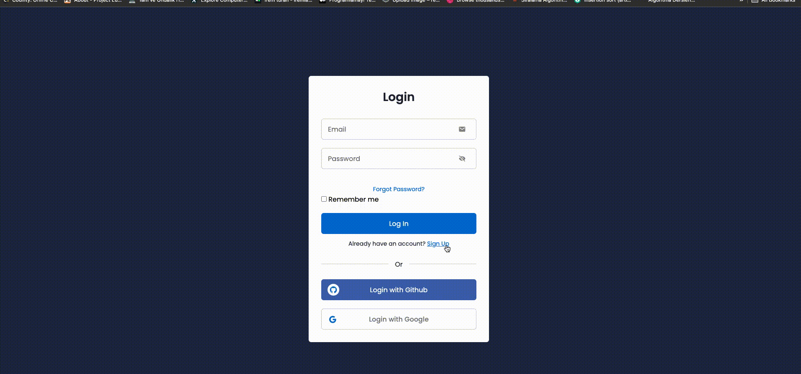
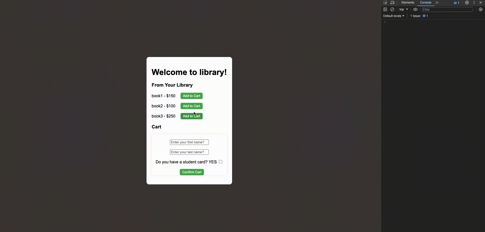

# JavaScript Projects
* * *
## Contains my own projects:
* * *
1. #### Login Form with Signup
2. #### To Do List
3. #### Chrome Extension (Lead Tracker):
    * I employed query method along with the Chrome Tab API to interact with the browser tab system. 
    * Additionally, I implemented the capability to store data in the Local Storage, for saving previous inputs in case of any loss. 
    * For icons, I used fontawesome.com to download the external resource into my package folder and load the script locally. Since Chrome extensions don't allow external scripts due to Content Security Policy. 
4. #### Color Flipper
    * Every time the button is clicked, the background color will change.
5. #### Student Card Discount
    * This is a simple library checkout process where customers can add books to their cart and make payments either with or without a library card, with appropriate discounts applied.
    * I worked on using ES6 features(class,constructor, inheritance) in this project.
6. #### Find Picture
    * Fetch the pictures from unsplash.com.
    * I used fontawesome.com to access icons and created an account to integrate them into my HTML page.
## Demo
* * *

